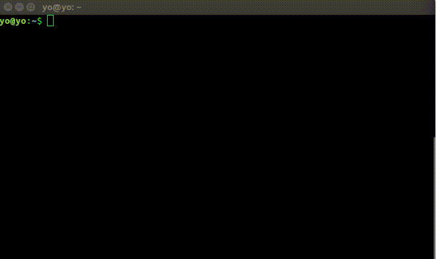

## Sass101

## สารบัญ
- บทที่ 1
  - [Install](#install)
  - [Convert](#convert)
  - [Watcher](#watcher)
  - [Compact](#compact)
  - [Compressed](#compressed)
  - [Expanded](#expanded)

## Install
พิมพ์คำสั่ง `sudo apt install -y ruby-sass`
ตรวจสอบเวอร์ชั่น พิมพ์คำสั่ง `sass -v`

## Convert
แปลงไฟล์ .scss เป็น .sass พิมพ์คำสั่ง `sass-convert example.scss example.sass` 
แปลไฟล์ .sass เป็น .scss พิมพ์คำสั่ง `sass-convert example.sass example.scss` 
แปลงไฟล์ .scss เป็น .css พิมพ์คำสั่ง `sass example.scss:example.css`

## Watcher
watch file พิมพ์คำสั่ง `sass --watch example.scss:example.css` 
watch directory พิมพ์คำสั่ง `sass --watch Directory:CSS`

## Compact
compact file พิมพ์คำสั่ง `sass example.scss:example.css --style compact` 
compack directory พิมพ์คำสั่ง `sass scss:css --style compact` 

## Compressed
compressed file พิมพ์คำสั่ง `sass example.scss:example.css --style compressed` 
compressed directory พิมพ์คำสั่ง `sass scss:css --style compressed` 

## Expanded
expanded file พิมพ์คำสั่ง `sass example.scss:example.css --style expanded` 
expanded directory พิมพ์คำสั่ง `sass scss:css --style expanded` 

_/\*หมายเหตุ\*/ กรณีไม่ต้องการไฟล์นามสกุล .map_ เพิ่ม option --sourcemap=none